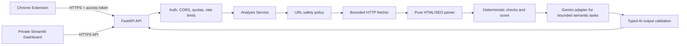

# Executive Summary

SEO-Sensei is a promising prototype, not a public-deployment-ready service. The repository contains a FastAPI API, a Streamlit application, a Manifest V3 popup, a synchronous `requests` crawler, and a Gemini integration, but there is no shared service boundary, authentication, abuse control, test suite, CI pipeline, container/deployment definition, or production configuration model.

The highest-risk issue is the crawler boundary. A caller-controlled URL reaches `requests.get()` with automatic redirects and no resolved-IP, redirect, content-type, or response-size policy. A public instance would therefore be an SSRF primitive that can reach cloud metadata, loopback, private networks, internal hostnames, or arbitrary redirect targets. The dashboard has the same unsafe crawler path independently.

Other deployment blockers are wildcard CORS with credentials, hard-coded localhost endpoints in the extension, unbounded Gemini endpoints, heuristic AI JSON parsing, trusting/rendering AI-generated HTML with Streamlit `unsafe_allow_html=True`, insufficient Pydantic constraints, leaking internal exception text to clients, and a score that is almost entirely an unverifiable Gemini opinion.

No implementation files were modified during this audit. The only intended repository addition is this report.

## Scope and evidence

The audit covered every tracked source, configuration, documentation, and asset file, including `backend/main.py`, `backend/models.py`, `backend/seo_crawler.py`, `backend/dashboard.py`, `backend/utils/gemini_helper.py`, all `frontend/*`, `requirements.txt`, `README.md`, `.gitignore`, and the Git-tracked file list. No tests, CI workflow, Dockerfile, compose file, lockfile, Procfile, or deployment manifest is present. A repository/history search found no actual API-key value; it found only the placeholder `GEMINI_API_KEY=your_gemini_api_key_here` in README history.

# Architecture Assessment

## Current architecture

The API, dashboard, crawler, and AI service share implementation details rather than a defined application/service layer:

- `backend/main.py` owns process startup, environment loading, CORS, routing, validation, orchestration, and error translation.
- `backend/seo_crawler.py` combines outbound HTTP, HTML parsing, heading extraction, and naive keyword counting.
- `backend/utils/gemini_helper.py` owns SDK setup, prompt construction, parsing, fallbacks, and three unrelated AI use cases.
- `backend/dashboard.py` imports the crawler and Gemini service directly, runs its own orchestration, accesses `service.model` and the private `_extract_json`, and duplicates API behavior.
- `frontend/popup.js` calls the API directly and contains environment-specific URLs.

This is workable for a local demo but makes security policy, validation, quotas, observability, and behavior inconsistent across entry points. The dashboard can bypass API controls entirely, and fixes made to the API would not automatically protect the dashboard.

## Separation-of-concerns findings

- **High — `backend/main.py`, lines 21-92:** startup configuration, URL normalization, business orchestration, logging, and HTTP error policy are in one route. Move configuration, request policy, use cases, and exception mapping behind modules with explicit interfaces.
- **High — `backend/dashboard.py`, lines 349-367 and 583-599:** the dashboard reimplements analysis and calls `service.model.generate_content_async()` directly. It can drift from API validation, timeout, quota, and AI schema behavior. Make both clients call one service/use-case layer, or make the dashboard an authenticated API client.
- **Medium — `backend/seo_crawler.py`, lines 7-90:** network transport, parsing, headings, and keyword heuristics are coupled. Separate a constrained fetcher from a pure HTML analyzer so security tests can exercise transport independently.
- **Medium — `backend/utils/gemini_helper.py`, lines 20-189:** one class mixes SEO evaluation, article generation, boost generation, JSON extraction, and fallback semantics. Split typed use cases and make parsing/schema validation common infrastructure.
- **Medium — `README.md`, lines 8-38 and 132-176:** documented comparison, competitor discovery, real-time metrics, page speed, and “multiple factors weighted” are not supported by the implementation. The documentation overstates the product and would mislead users/recruiters.

# Critical Security Findings

## C-01: SSRF through the API crawler

- **Severity:** Critical
- **File:** `backend/main.py:52-92`; `backend/seo_crawler.py:7-27`
- **Current behavior:** `POST /analyse-url` accepts a caller URL and passes it to `fetch_html`; `fetch_html` calls `requests.get(url, ...)`.
- **Why it is a problem:** A public caller can target `http://127.0.0.1`, RFC1918 addresses, link-local cloud metadata, IPv6 loopback/private ranges, internal DNS names, or administrative services. The syntax validator does not establish that the destination is safe.
- **Recommended fix:** Normalize with a strict URL parser; allow only HTTP(S), reject credentials, fragments where unnecessary, nonstandard ports unless explicitly allowed, localhost/internal names, and all reserved/private/link-local/multicast/loopback/unspecified IP ranges. Resolve the hostname and validate every returned address immediately before connecting. Use a controlled HTTP client or custom transport that pins the validated address and preserves the intended Host/SNI behavior. Re-check each redirect destination.
- **Deployment impact:** Blocker. Do not expose `/analyse-url` publicly until this policy is implemented and tested against IPv4, IPv6, decimal/hex IPs, IDNs, DNS aliases, and cloud metadata addresses.

## C-02: Redirect-based SSRF and DNS rebinding

- **Severity:** Critical
- **File:** `backend/seo_crawler.py:19`
- **Current behavior:** `requests.get()` follows redirects by default. There is no redirect count, scheme restriction, destination validation, or final-host policy. DNS resolution is delegated to the connection layer with no pinning or revalidation.
- **Why it is a problem:** A safe-looking public URL can redirect to an internal URL. A hostname can resolve to a public address during validation and to a private address at connection time, or return mixed public/private answers. Redirect hops can also change HTTP to HTTPS or vice versa without policy.
- **Recommended fix:** Set `allow_redirects=False` and implement a bounded redirect loop, validating each `Location` as an absolute/ resolved safe HTTP(S) target. Re-resolve and validate each hop; cap hops and total elapsed time; reject cross-host redirects by default or apply the same policy to every host. Use a connection strategy that prevents time-of-check/time-of-use DNS drift.
- **Deployment impact:** Blocker for any user-supplied URL fetch.

## C-03: No response-size or content-type limit

- **Severity:** Critical
- **File:** `backend/seo_crawler.py:19-21`
- **Current behavior:** The entire response is loaded through `response.text`, without checking `Content-Length`, streaming chunks, decompression expansion, MIME type, or maximum HTML/body size.
- **Why it is a problem:** An attacker can supply a large response, compression bomb, or non-HTML payload to exhaust memory/CPU before BeautifulSoup parses it. `Accept` includes `*/*`, and arbitrary binary content is accepted as text.
- **Recommended fix:** Stream with a hard byte budget, abort once the limit is exceeded, cap decompressed bytes, require an HTML/XHTML content type (with a documented tolerance for missing headers), and parse only the bounded bytes. Set a maximum body-text length before prompt construction.
- **Deployment impact:** Blocker for production availability.

## C-04: Public unauthenticated expensive operations

- **Severity:** Critical
- **File:** `backend/main.py:96-127`; `backend/main.py:52-92`; `frontend/popup.js:83-120`
- **Current behavior:** `/generate-article`, `/analyse-url`, and `/boost-seo` require no authentication, client identity, quota, or rate limit. Each analysis can invoke both a target fetch and Gemini; boost invokes Gemini again; article generation is direct AI spend.
- **Why it is a problem:** Anyone who discovers the endpoint can consume the project’s Gemini quota, force outbound requests, and create concurrent CPU/network work. `/boost-seo` accepts a client-supplied full analysis, so a caller can repeatedly submit arbitrary large content to Gemini without first performing an analysis.
- **Recommended fix:** For a portfolio deployment, use a small server-side signed/API access token for the extension/demo, per-IP and per-token rate limits, concurrency limits, request/body budgets, daily Gemini budget, and 429 responses. Remove or protect article/competitor features unless they are intentionally in scope.
- **Deployment impact:** Blocker where the Gemini key is billable or the service is reachable from the Internet.

## C-05: Permissive CORS configuration

- **Severity:** High
- **File:** `backend/main.py:33-49`
- **Current behavior:** `PRODUCTION_ORIGINS` contains a specific extension origin but middleware uses `allow_origins=["*"]`, `allow_credentials=True`, and `allow_headers=["*"]`.
- **Why it is a problem:** The declared production allowlist is dead configuration. Any web origin can attempt browser calls; wildcard-plus-credentials is an unsafe and internally inconsistent policy. CORS is not authentication, so it also gives a false sense of protection.
- **Recommended fix:** Select origins from environment configuration and use an exact allowlist for the deployed extension ID and dashboard origin. Set `allow_credentials=False` unless cookie credentials are required; if credentials are required, never use `*`. Restrict methods and headers to the actual API contract.
- **Deployment impact:** Blocker before public browser access.

## C-06: Unsafe HTML injection in dashboard

- **Severity:** High
- **File:** `backend/dashboard.py:304`, `511`, `520`, `543`, `552`, `665`, `674`, `710-727`, `733`, `780-796`
- **Current behavior:** AI output, user-controlled URLs/domains/industry, competitor strings, and generated article HTML are interpolated into `st.markdown(..., unsafe_allow_html=True)`. Article content is intentionally rendered as raw HTML.
- **Why it is a problem:** A compromised/malicious target page can influence prompt input and AI output. Malicious AI or competitor text can inject markup/links/scripts depending on Streamlit/browser sanitization behavior. Rendering generated HTML also creates phishing/link and stored-session risks.
- **Recommended fix:** Render untrusted values with normal Streamlit components or escape HTML; sanitize generated article HTML with a strict allowlist and remove scripts, event handlers, dangerous URLs, iframes, forms, and styles. Treat AI output as data, not trusted markup.
- **Deployment impact:** High risk to dashboard users; block public sharing until addressed.

## C-07: Extension endpoint is HTTP localhost

- **Severity:** High
- **File:** `frontend/popup.js:32-35`, `242-245`; `README.md:228`
- **Current behavior:** API calls use `http://127.0.0.1:8000`; the dashboard button opens `http://localhost:8501`.
- **Why it is a problem:** The published extension cannot reach the user’s developer machine; HTTP permits local interception; deployments cannot configure the endpoint without rebuilding. A malicious local process can impersonate the API on those ports and return misleading data.
- **Recommended fix:** Use a production HTTPS API origin from an explicit build/configuration mechanism, ship a separate development configuration, and remove localhost defaults from the release artifact. The dashboard link must also be a configured HTTPS URL.
- **Deployment impact:** Blocker for a usable public extension.

## C-08: Internal exception details are returned to clients

- **Severity:** High
- **File:** `backend/main.py:90-92`, `108-110`, `125-127`; `backend/dashboard.py:365-367`
- **Current behavior:** Exception strings are placed directly in HTTP `detail` or dashboard error output.
- **Why it is a problem:** Network/library errors can reveal internal hostnames, proxy details, file paths, SDK state, or target response information. Broad `except Exception` also converts programming defects into inconsistent 500 responses.
- **Recommended fix:** Log a correlation ID and sanitized exception server-side; return stable error codes/messages to clients. Catch expected categories separately and preserve intentional HTTP exceptions.
- **Deployment impact:** High; fix before public exposure and before collecting user data.

# High Priority Findings

## H-01: Pydantic request models are effectively unbounded

- **Severity:** High
- **File:** `backend/models.py:7-10`, `19-20`, `22-35`, `39-41`
- **Current behavior:** Topic, keywords, tone, URL, lists, strings, status, score, and headers have no length, count, range, or enum constraints. `AnalyseResponse` is reused as the `/boost-seo` request model.
- **Why it is a problem:** Large bodies can amplify memory/prompt costs; arbitrary tone/topic values can alter prompts; `seo_score` accepts any integer; boost trusts client-provided analysis fields.
- **Recommended fix:** Add strict Pydantic v2 constraints (`AnyHttpUrl` only as syntax validation, bounded `max_length`/`max_items`, score 0-100, enumerated content quality, bounded header values), reject unknown fields where appropriate, and define separate internal and public request/response models. Recompute boost input server-side or accept only a small typed page summary.
- **Deployment impact:** High for cost and reliability.

## H-02: AI responses are not schema-validated before use

- **Severity:** High
- **File:** `backend/utils/gemini_helper.py:46-52`, `84-94`, `126-135`, `138-174`; `backend/dashboard.py:596-599`, `773-774`
- **Current behavior:** `_extract_json` takes the substring between the first `{` and last `}`, or first `[` and last `]`, then returns arbitrary JSON. Dashboard callers use it directly. Route response models are the first meaningful validation for some paths, while article/boost fallbacks and dashboard data are not consistently validated.
- **Why it is a problem:** Extra prose/braces, truncated output, wrong types, huge arrays, unsafe HTML, or semantically invalid scores can pass parsing or cause runtime errors. A list can be returned where a dict is expected. Prompt injection can manipulate structure/content.
- **Recommended fix:** Request structured output where supported; validate every response with dedicated Pydantic models and bounded fields, reject/repair invalid responses, and distinguish AI failure from a valid result. Do not use private parser methods from the dashboard.
- **Deployment impact:** High; invalid output currently becomes user-visible or can crash a session.

## H-03: Gemini calls have no application-level timeout/cancellation or retry policy

- **Severity:** High
- **File:** `backend/utils/gemini_helper.py:47`, `85`, `127`; `backend/dashboard.py:596`, `700`, `773`
- **Current behavior:** Async Gemini calls are awaited without an operation timeout, cancellation budget, concurrency cap, retry/backoff, or clear transient/permanent error classification.
- **Why it is a problem:** Hung or slow provider calls occupy workers and dashboard event-loop sessions. Retrying blindly could multiply cost; no retry means transient failures surface as fake fallback success.
- **Recommended fix:** Wrap each provider call in a bounded timeout; limit concurrent calls; use bounded exponential retry only for known transient failures; record usage/error metrics; return a typed “AI unavailable” state rather than score 0 as if it were a real score.
- **Deployment impact:** High availability and cost risk.

## H-04: Prompt injection and excessive prompt payloads

- **Severity:** High
- **File:** `backend/utils/gemini_helper.py:25-44`, `106-125`; `backend/dashboard.py:583-595`
- **Current behavior:** Page-derived titles, descriptions, headings, keywords, and in the dashboard `analysis_data` including `body_text` are interpolated directly into prompts. No delimiters, length cap, provenance labeling, or instruction/data separation exists.
- **Why it is a problem:** Target page content can instruct the model to ignore the task or emit attacker-controlled markup. Full body text can cause high token usage and latency.
- **Recommended fix:** Keep deterministic extraction separate; pass bounded, labeled data fields in a structured request; remove raw body text from prompts unless explicitly needed and truncate it; define output constraints and validate output. Never let page text define system instructions.
- **Deployment impact:** High for correctness, cost, and dashboard safety.

## H-05: Dashboard users bypass API validation and abuse controls

- **Severity:** High
- **File:** `backend/dashboard.py:349-367`, `399-408`, `574-601`, `697-706`, `762-776`
- **Current behavior:** Streamlit calls `get_full_seo_analysis_for_url` directly and calls Gemini directly for gap, articles, and competitors. URL fields are only checked for non-empty values.
- **Why it is a problem:** Even if FastAPI is hardened, the public dashboard remains an independent SSRF and cost path. Synchronous crawler calls also block the event loop used by the dashboard wrapper.
- **Recommended fix:** Put all fetch/AI work behind the same validated service boundary, or keep Streamlit private and make it a client of the API. Apply the same auth, quotas, timeouts, output schemas, and safe rendering.
- **Deployment impact:** Blocker if the dashboard is publicly reachable.

## H-06: Analysis route performs blocking I/O inside `async def`

- **Severity:** High
- **File:** `backend/seo_crawler.py:7-27`, called from `backend/main.py:55-70`
- **Current behavior:** `requests.get()` is synchronous, but the route is declared async and directly awaits a function that performs blocking work.
- **Why it is a problem:** Each slow target monopolizes the event-loop thread, reducing concurrency and making timeout/worker behavior unpredictable.
- **Recommended fix:** Prefer one async HTTP client with explicit limits, or run a strictly bounded synchronous fetcher in a worker thread. Do not mix unbounded blocking calls into async routes.
- **Deployment impact:** High under concurrent traffic.

## H-07: Logging contains user URLs and verbose tracebacks

- **Severity:** High
- **File:** `backend/main.py:64`, `73`, `91`, `109`, `126`; `backend/seo_crawler.py:23-26`; `backend/dashboard.py:357`, `366`
- **Current behavior:** Full submitted URLs and exception details are logged; broad handlers use `exc_info=True`.
- **Why it is a problem:** Query strings may contain tokens or personal data; logs may expose internal network targets and become a privacy/security liability. There is no correlation ID or redaction policy.
- **Recommended fix:** Log normalized host plus request ID, not complete URL/query; redact credentials and sensitive headers; use structured logs, retention limits, access controls, and separate debug logging from production.
- **Deployment impact:** High for privacy and incident response.

## H-08: No authentication, authorization, CSRF/session policy, or origin trust model

- **Severity:** High
- **File:** `backend/main.py:30-49`; all routes
- **Current behavior:** All endpoints are anonymous and state-free; CORS is treated as the only browser boundary.
- **Why it is a problem:** Attackers can call endpoints outside a browser and spend resources. If cookies or a future dashboard session are added, CSRF policy is undefined.
- **Recommended fix:** Use a minimal access-token model for the portfolio demo, validate it server-side, keep API keys server-only, and document whether endpoints are public/private. If cookie sessions are added later, add CSRF protection and exact trusted origins.
- **Deployment impact:** High, with C-04 making it a blocker for public operation.

## H-09: Generated article HTML is not safely modeled

- **Severity:** High
- **File:** `backend/models.py:12-15`; `backend/utils/gemini_helper.py:67-81`, `90-94`; `backend/dashboard.py:712-727`
- **Current behavior:** `ArticleResponse.content` is unrestricted `str`, the model is asked for HTML, and the dashboard renders it directly.
- **Why it is a problem:** No HTML policy, maximum length, link policy, or content moderation exists. The fallback itself returns HTML and callers cannot tell success from error reliably.
- **Recommended fix:** Return structured blocks or sanitized HTML with an allowlist; enforce length and URL policies; validate title/suggestions; include an explicit `status`/error type and never display provider error content as an article.
- **Deployment impact:** High for dashboard safety and output quality.

## H-10: Dependency and runtime reproducibility is weak

- **Severity:** High
- **File:** `requirements.txt:3-19`
- **Current behavior:** Direct versions are pinned, but there is no hash-locked lockfile, Python version pin, vulnerability scan configuration, or separation of runtime/dev dependencies. The legacy `google-generativeai==0.4.1` SDK is used with a newer-looking model name.
- **Why it is a problem:** Builds are not reproducible enough for production and provider SDK/model compatibility is not established. `gunicorn` is included without a documented Windows/Linux entrypoint or worker model.
- **Recommended fix:** Choose and document a supported Python version, generate a lockfile with hashes, scan dependencies in CI, verify the Gemini SDK/model contract, and split API/dashboard dependencies if deployed separately.
- **Deployment impact:** High release-risk, though not itself the SSRF blocker.

# Medium Priority Findings

## M-01: URL validation is syntax-only and normalization is unsafe

- **Severity:** Medium
- **File:** `backend/main.py:56-65`
- **Current behavior:** Missing scheme is prefixed with `https://`; `validators.url()` is used; no canonical parser policy follows.
- **Why it is a problem:** Syntax validity does not guarantee safe scheme/host/port/IP, and prefixing can create surprising interpretations. Credentials, fragments, IDNs, unusual ports, and encoded host forms are not explicitly handled.
- **Recommended fix:** Parse once with a strict URL type and explicit policy; canonicalize the host with IDNA, reject userinfo and unsupported ports, and pass only the canonical form into the fetcher.
- **Deployment impact:** Medium alone, critical when combined with C-01.

## M-02: Redirect/status semantics are misleading

- **Severity:** Medium
- **File:** `backend/seo_crawler.py:19-27`, `66-90`
- **Current behavior:** `raise_for_status()` treats 4xx/5xx as failure, but follows redirects and returns the final status; no original/final URL is recorded. A non-HTML successful response can be parsed.
- **Why it is a problem:** Users cannot tell what was actually analyzed. Redirect chains and status-specific SEO checks are impossible; failures are not modeled consistently.
- **Recommended fix:** Return original URL, final URL, redirect chain, status, MIME, and fetch timing in a typed result; define whether non-2xx HTML is analyzable; retain safe redirect policy.
- **Deployment impact:** Medium correctness and security observability.

## M-03: SEO extraction is incomplete and the keyword heuristic is poor

- **Severity:** Medium
- **File:** `backend/seo_crawler.py:29-90`
- **Current behavior:** It extracts title, description, body text, h1-h3, and the ten most frequent alphabetic words longer than four characters. It does not strip navigation/boilerplate or use language-aware tokenization/stopwords.
- **Why it is a problem:** Frequent words are not search intent or target keywords; punctuation, inflection, multilingual content, hidden text, and navigation distort results. `fetch_headers` is actually heading extraction, not HTTP header analysis.
- **Recommended fix:** Build a deterministic audit model that measures explicit SEO signals and clearly label lexical terms as “frequent terms,” not keywords. Use language-aware tokenization only as optional supporting evidence.
- **Deployment impact:** Medium product credibility.

## M-04: No deterministic SEO rule engine or explainable scoring

- **Severity:** Medium
- **File:** `backend/utils/gemini_helper.py:25-44`; `README.md:170-175`; `backend/dashboard.py:619-648`
- **Current behavior:** Gemini is asked for a 0-100 score from a small subset of fields. The dashboard presents it as an objective score and compares it to 80/90 thresholds.
- **Why it is a problem:** Repeated requests can produce different scores; missing data can be treated as good; there is no evidence or weighted rule breakdown; docs claim metrics not calculated.
- **Recommended fix:** Calculate a deterministic score from versioned checks with evidence and weights. Use Gemini for interpretation, prioritization, semantic/content suggestions, and draft generation—not for facts that can be parsed from HTML/HTTP.
- **Deployment impact:** Medium-to-high recruiter and user trust impact.

## M-05: Obsolete meta keywords functionality

- **Severity:** Medium
- **File:** `backend/utils/gemini_helper.py:116-124`; `frontend/popup.html:45-49`; `frontend/popup.js:109-111`; `README.md:37`
- **Current behavior:** The product asks Gemini to generate 5-7 “meta keywords” and advertises auto-generated keywords.
- **Why it is a problem:** The `meta keywords` tag is ignored by major search engines and can encourage keyword stuffing. It is not a meaningful modern SEO recommendation.
- **Recommended fix:** Remove the meta-keywords output and replace it with a “search intent and topic coverage” feature: extract candidate entities/terms from visible content, identify missing subtopics/questions, and generate title/meta-description variants plus internal-link and structured-data suggestions. Keep deterministic evidence separate from Gemini’s semantic suggestions.
- **Deployment impact:** Medium product correctness; remove before marketing publicly.

## M-06: Dashboard XSS-like rendering also affects ordinary user input

- **Severity:** Medium
- **File:** `backend/dashboard.py:401`, `426`, `764`, `780`, `794`
- **Current behavior:** URL/domain/industry values are embedded into spinners, errors, headings, and HTML links. `target="_blank"` has no `rel="noopener noreferrer"`.
- **Why it is a problem:** Even without AI compromise, attacker-supplied form text reaches HTML output. Link construction uses unvalidated Gemini competitor strings.
- **Recommended fix:** Avoid raw HTML for dynamic values; use safe Streamlit text/link components; validate competitor hostnames and add safe link attributes if HTML remains.
- **Deployment impact:** Medium dashboard security.

## M-07: Async event-loop caching in Streamlit is fragile

- **Severity:** Medium
- **File:** `backend/dashboard.py:314-331`
- **Current behavior:** A cached event loop is reused across Streamlit reruns and synchronous `run_until_complete` calls; network work remains blocking.
- **Why it is a problem:** Session/thread ownership, closed loops, concurrent reruns, and provider coroutine state can produce runtime failures.
- **Recommended fix:** Use a supported synchronous service for the dashboard or isolate async work in a controlled worker; do not cache a mutable event loop globally as a resource.
- **Deployment impact:** Medium reliability.

## M-08: API responses expose excessive crawl data and inconsistent names

- **Severity:** Medium
- **File:** `backend/main.py:79-86`; `backend/models.py:31-35`
- **Current behavior:** The response returns `headers`, but the value is h1/h2/h3 heading text; crawler body text is also carried internally into AI paths. Response fields do not identify fetch time, final URL, MIME, or evidence.
- **Why it is a problem:** Naming misleads consumers, and returning large/unnecessary data increases payload size and privacy exposure.
- **Recommended fix:** Define a small versioned analysis schema with `headings`, deterministic checks, evidence, and bounded summaries; do not return raw body text.
- **Deployment impact:** Medium API maintainability.

## M-09: Fallbacks hide outages as valid SEO results

- **Severity:** Medium
- **File:** `backend/utils/gemini_helper.py:50-52`, `90-94`, `130-135`, `163-174`
- **Current behavior:** AI failure returns score 0 or strings such as “Error: Generation Failed” inside normal response models.
- **Why it is a problem:** Consumers cannot distinguish a real score of 0 from provider failure, and error text can be displayed as content.
- **Recommended fix:** Use explicit typed status/error envelopes and HTTP 503/429 for provider failures where appropriate. Keep fallback deterministic checks separate from AI results.
- **Deployment impact:** Medium trust/operations risk.

## M-10: Documentation and naming are inconsistent

- **Severity:** Medium
- **File:** `README.md` throughout; `backend/main.py:30`; `backend/dashboard.py:18`; repository name `SEO-Sensei`
- **Current behavior:** Product names alternate between SEO-Sensei and Metamorph; README references a placeholder repository URL and features absent from source; `assests` is misspelled.
- **Why it is a problem:** Recruiters and users cannot reproduce or understand the actual system; deployment instructions are local-only.
- **Recommended fix:** Rewrite documentation around implemented endpoints, real limits, actual architecture, environment variables, security model, extension build configuration, and deployment steps.
- **Deployment impact:** Medium portfolio quality.

# Low Priority Findings

## L-01: Hard-coded local development URLs

- **Severity:** Low in local development, High for release usability
- **File:** `frontend/popup.js:33`, `frontend/popup.js:244`, `README.md:228`
- **Current behavior:** The exact hard-coded URLs are `http://127.0.0.1:8000` and `http://localhost:8501`.
- **Why it is a problem:** The release artifact is environment-specific and uses insecure HTTP.
- **Recommended fix:** Externalize release origins and document dev/prod builds.
- **Deployment impact:** Public extension cannot work as shipped.

## L-02: Manifest version/configuration is minimal

- **Severity:** Low
- **File:** `frontend/manifest.json:1-14`
- **Current behavior:** Manifest V3 has only `activeTab`, popup, and icons; no release metadata, options/configuration, host permissions strategy, or update policy.
- **Why it is a problem:** The extension cannot cleanly support a configured production API or explain restricted-page behavior.
- **Recommended fix:** Add only the minimum permissions required, an options/configuration path or compile-time origin, and a documented release process. Avoid broad host permissions.
- **Deployment impact:** Low after endpoint architecture is fixed.

## L-03: Extension UX does not handle restricted or non-HTTP pages explicitly

- **Severity:** Low
- **File:** `frontend/popup.js:45-80`
- **Current behavior:** Any active-tab URL is submitted if present.
- **Why it is a problem:** `chrome://`, extension pages, local files, PDFs, login pages, and unsupported schemes may fail unclearly or be inappropriate to send to the server.
- **Recommended fix:** Validate supported schemes/page types client-side, explain restrictions, and disable analysis where no safe public HTML fetch is possible.
- **Deployment impact:** Low UX/reliability.

## L-04: Accessibility and responsive behavior are incomplete

- **Severity:** Low
- **File:** `frontend/popup.html`, `frontend/popup.css`, `backend/dashboard.py` CSS
- **Current behavior:** Buttons and dynamic regions have no explicit loading/disabled/ARIA state model; status/error updates are not announced; dashboard relies heavily on visual color/emoji; large fixed typography and two-column layouts are not clearly tested at narrow widths.
- **Why it is a problem:** Keyboard, screen-reader, color-vision, and small-screen users receive weaker feedback.
- **Recommended fix:** Add labels, focus states, `aria-live` status regions, semantic headings, non-color indicators, disabled states, and responsive layout tests.
- **Deployment impact:** Low functional blocker, important for portfolio quality.

## L-05: Code quality and maintainability issues

- **Severity:** Low
- **File:** all Python/JS files
- **Current behavior:** Comments such as “NEW” and “DEMO” remain; imports and UI styling are large and monolithic; no formatter/linter configuration exists.
- **Why it is a problem:** Reviewability and safe change velocity are reduced.
- **Recommended fix:** Add formatting/lint/type-check configuration in the implementation phase; remove stale comments and split modules by responsibility.
- **Deployment impact:** Low immediate, high long-term maintenance cost.

# SEO Engine Assessment

## Deterministic checks that should stay in code

The following are facts available from the fetched document/response and should not be delegated to Gemini:

- HTTP status, final URL, redirect count, response time, MIME type, byte size, and HTTPS usage.
- Title presence, character/Unicode length, duplicate/empty title, and likely truncation warnings.
- Meta description presence, length, duplicate/empty value, and truncation warnings.
- Heading structure: count of h1, empty headings, hierarchy jumps, and heading text.
- Canonical URL presence/validity and whether it is same-origin, where policy permits.
- Robots meta directives, `X-Robots-Tag`, viewport tag, hreflang links, language attribute, Open Graph/Twitter tags, and JSON-LD presence/parseability.
- Image count, missing/empty alt attributes, and bounded image URL metadata (without fetching every image by default).
- Internal/external link counts, missing anchors, nofollow/sponsored/ugc attributes, and malformed links.
- Visible-text word count and repeated-term statistics, labeled as lexical signals rather than search keywords.
- Security/transport facts such as HTTPS, mixed-content references, and relevant response headers.

Gemini is appropriate for bounded semantic interpretation: content clarity/readability suggestions, search-intent/topic coverage hypotheses, prioritization of deterministic findings, title/description variants, content briefs, and article drafts. Gemini should not decide whether a tag exists, whether an HTTP status is 200, whether a score is reproducible, or whether a security property is true.

## Scoring recommendation

Create a versioned deterministic score with visible evidence and weights, for example technical/indexability, metadata, headings/content structure, links, structured data, and accessibility signals. Keep the score stable for identical input. Present AI recommendations separately with confidence/limitations. Do not claim page speed, mobile responsiveness, rankings, authority, competitor traffic, or backlink data until those data sources are actually implemented.

## Meta keywords decision

Remove the current meta-keywords feature. Search engines generally ignore the `meta keywords` tag, so generating it is technically obsolete and may encourage stuffing. Replace it with “topic coverage opportunities” backed by extracted entities/terms and missing sections/questions, plus title/meta-description alternatives, internal-link targets, and structured-data recommendations. This is more useful, explainable, and aligned with modern SEO work.

# AI/Gemini Assessment

- **Provider boundary:** Keep the API key only in server-side environment/secret storage. The current source does not expose the key to the extension, but error and debug handling should never include it. Do not put it in a client bundle or Streamlit/browser state.
- **Model contract:** Pin a provider SDK/model contract that is tested in CI. `google-generativeai==0.4.1` and `gemini-2.5-flash` need compatibility verification before release; the README’s claimed model is not a substitute for a tested runtime.
- **Structured output:** Replace substring extraction with provider-supported structured output where available, followed by Pydantic validation. Enforce list counts, string lengths, score bounds, enum values, HTML policy, and total output size.
- **Reliability:** Add timeout, cancellation, bounded retries, concurrency limits, provider error classification, metrics, and explicit unavailable states. Never treat “AI failed” as a valid SEO score.
- **Cost controls:** Bound every input field, truncate page-derived text, cap generated article length, restrict expensive endpoints, rate-limit per client/IP, and maintain a daily/monthly budget alert. Do not expose an unrestricted competitor/article generation surface in the first public version.
- **Prompt safety:** Treat fetched text as hostile data, delimit it, label it untrusted, and avoid sending raw body text unless required. Validate all outputs before storage or rendering.

# Chrome Extension Assessment

## Architecture and security

The popup-only Manifest V3 design is a reasonable prototype, but it has no production configuration story. `activeTab` is narrow, which is good, but it also means restricted pages and non-HTML contexts need explicit handling. The popup posts the active tab URL to the server; the server must not trust that the URL came from Chrome and still needs full SSRF protection.

The current popup uses `textContent` for most results and escapes header text before `innerHTML`, which is a positive local XSS property. Preserve that pattern. It should additionally validate response shape, handle non-JSON errors, avoid assuming `headers[tag]` exists, disable buttons during requests, handle cancellation/stale responses, and never display raw provider error text.

The dashboard button and API URLs are hard-coded to local HTTP. Release builds require a configured HTTPS origin. CORS should allow only the actual extension origin and dashboard origin; the extension must not receive the Gemini key.

# Dashboard Assessment

The Streamlit dashboard has substantial presentation work and demonstrates comparison, gap, content, and competitor flows, but it is not safe to expose as-is. It directly owns crawler and Gemini calls, validates URLs only by non-empty strings, has no rate limiting/auth, uses a cached mutable event loop, and interpolates dynamic values into `unsafe_allow_html` blocks.

For a portfolio deployment, choose one public surface first. The simplest safe choice is a hardened FastAPI API plus the extension, with Streamlit kept private/local for demonstration. If the dashboard must be public, make it an authenticated API client and remove direct crawler/provider access; then apply output escaping/sanitization and session/resource limits.

# Testing Gaps

There is no test directory or test dependency. Before release, add tests for:

- URL parsing and canonicalization: missing schemes, credentials, fragments, ports, IPv4/IPv6, decimal/hex/encoded IPs, IDNs, localhost, private/link-local/reserved ranges, and unsupported schemes.
- DNS rebinding/mixed DNS answers and every redirect hop, including cross-scheme/cross-host redirects.
- Fetch limits: connect/read/total timeout, redirect count, body bytes, compression expansion, MIME mismatch, malformed charset, and non-HTML content.
- HTML extraction fixtures: malformed HTML, missing tags, duplicate tags, headings, canonical/robots/OG/JSON-LD, alt text, links, multilingual and boilerplate-heavy pages.
- Deterministic scoring: versioned weights, boundary values, missing data, and repeatability.
- Pydantic request/response limits, unknown fields, invalid types, and maximum payloads.
- Gemini provider mocks: valid structured output, prose wrappers, malformed JSON, wrong types, injection text, timeout, quota, retry, and provider outage.
- API behavior: auth, CORS preflight, 400/413/429/503 responses, correlation IDs, and absence of secret/internal detail leakage.
- Dashboard escaping/sanitization and extension response handling.
- End-to-end smoke tests with a local controlled HTTP fixture; never use arbitrary Internet targets in CI.

Add linting, formatting, static typing where practical, dependency vulnerability scanning, secret scanning, and a CI job that builds/tests the exact production artifact.

# Deployment Blockers

The following must be resolved before a public deployment:

1. C-01/C-02: SSRF, redirect, DNS resolution, and DNS-rebinding policy.
2. C-03: streaming response-size, decompression, and content-type limits.
3. C-04/H-08: authentication/access control, rate limits, concurrency limits, and Gemini budget controls.
4. C-05: exact production CORS configuration.
5. C-07/L-01: production HTTPS API/dashboard endpoint configuration; remove localhost release defaults.
6. C-06/H-09/M-06: safe rendering and HTML sanitization in Streamlit.
7. H-01/H-02: bounded Pydantic contracts and typed AI output validation.
8. H-03/H-04/H-07/M-09: provider timeouts, prompt/input limits, safe errors, redacted structured logging, and explicit AI-failure states.
9. H-05/H-06/M-07: one protected service boundary and a non-blocking/controlled I/O model.
10. M-04/M-05: replace unverifiable AI-only scoring and remove obsolete meta-keywords generation.
11. Testing Gaps: security, contract, crawler-limit, and smoke tests with CI.
12. H-10: reproducible dependency/runtime build and a documented deployment command.

# Recommended Target Architecture

## Proposed Target Architecture



Responsibilities:

- **Client:** collect user intent, display typed results, never hold Gemini credentials, and handle only client UX validation.
- **API:** authentication, request limits, CORS, correlation IDs, stable error envelopes, and endpoint versioning.
- **Service layer:** one use case for analysis/boost/article; no UI-specific behavior.
- **URL safety policy/fetcher:** strict HTTP(S) policy, validated DNS/IP connection, bounded redirects, timeouts, body/MIME limits, and no arbitrary network protocols.
- **Parser/score:** deterministic, pure, testable extraction and versioned evidence-based scoring.
- **AI adapter:** provider-specific SDK calls, prompt construction from bounded data, timeouts/retries, cost accounting, and typed output validation.
- **Dashboard:** presentation/client only; no direct crawler or provider access.

## Recommended Deployment Architecture

For a student portfolio, use one small HTTPS-capable platform deployment running FastAPI behind the platform’s TLS proxy, with one managed environment-secret `GEMINI_API_KEY`. Serve the extension as a separately configured release artifact. Keep Streamlit local or protected behind the same access-control boundary until it has been converted into an API client.

No Kubernetes, microservices, Kafka, Redis, or database is required for the first safe version. Use in-process bounded rate limiting only for a single-instance demo, and state clearly that it is not a multi-instance control. If traffic grows, add a managed rate-limit/store service as a measured follow-up—not as a prerequisite. Add platform logs/metrics, health/readiness endpoints, HTTPS-only configuration, restrictive egress if available, and a small process/worker count appropriate to the crawler’s I/O model.

# Recommended Project Structure

```text
SEO-Sensei/
├── app/
│   ├── main.py                 # FastAPI wiring and lifespan
│   ├── config.py               # typed environment settings
│   ├── api/
│   │   ├── routes_analysis.py
│   │   ├── routes_content.py
│   │   └── errors.py
│   ├── schemas/                # public and internal Pydantic models
│   ├── services/
│   │   ├── analysis.py
│   │   ├── content.py
│   │   └── quotas.py
│   ├── security/
│   │   ├── auth.py
│   │   ├── cors.py
│   │   └── url_policy.py
│   ├── crawler/
│   │   ├── fetcher.py          # bounded, safe transport
│   │   └── parser.py           # pure HTML analysis
│   └── ai/
│       ├── gemini.py           # provider adapter
│       └── output_models.py
├── dashboard/                  # API client + safe Streamlit presentation
├── extension/                  # configured Manifest V3 release source
├── tests/
│   ├── unit/
│   ├── security/
│   ├── integration/
│   └── fixtures/
├── pyproject.toml              # tooling and dependency metadata
├── lockfile                    # generated, hash-locked dependencies
├── Dockerfile                  # only if chosen by deployment platform
├── .env.example                # names only, no values
└── README.md
```

# Ordered Implementation Roadmap

1. Freeze the public scope: analysis plus deterministic audit first; keep article, competitor, and public dashboard features private until their controls are complete.
2. Define typed configuration, supported Python/provider versions, production origins, access-token strategy, limits, error envelope, logging/redaction policy, and score version.
3. Extract a shared service boundary and make FastAPI and Streamlit use it; remove dashboard access to private Gemini/parser methods.
4. Implement and unit-test strict URL parsing, hostname/IP validation, DNS-rebinding defenses, bounded redirects, timeout budgets, content-type checks, streaming byte limits, and safe egress behavior.
5. Add bounded Pydantic public/internal schemas and reject oversized or unknown/untrusted fields; redesign `/boost-seo` so it does not trust a client-supplied full analysis.
6. Add authentication, exact CORS, per-client/IP rate limits, concurrency limits, request-size limits, endpoint quotas, and Gemini budget/usage controls.
7. Replace the crawler’s naive keyword/scoring behavior with deterministic, evidence-backed SEO checks; remove meta keywords and implement topic-coverage/intent opportunities instead.
8. Harden Gemini: structured output, schema validation, prompt-data delimiting, truncation, timeout/cancellation, bounded retries, safe fallback states, and output moderation/sanitization.
9. Remove unsafe dashboard HTML interpolation; render untrusted values safely and sanitize any intentionally supported article markup.
10. Configure the extension for HTTPS production origins, handle restricted pages and non-JSON errors, add loading/accessibility states, and verify the minimum Manifest V3 permissions.
11. Add the security, crawler, parser, schema, AI-mock, API, dashboard, and extension tests listed above; add lint/format/type checks, secret scanning, dependency scanning, and CI.
12. Add a reproducible deployment artifact and health/readiness checks; deploy one small FastAPI instance behind HTTPS with the Gemini key in managed secrets.
13. Perform a pre-release threat-model review and external smoke test using controlled URLs; confirm no local URL defaults, no key in client assets, restrictive CORS, bounded egress, sanitized output, and useful operational logs.
14. Update README and recruiter-facing documentation to describe only implemented behavior, architecture decisions, security constraints, reproducible setup, test evidence, and known limitations.

# Implementation Order

1. Establish scope, configuration, typed contracts, and the production threat model.
2. Build the shared service boundary and safe URL/HTTP fetcher.
3. Add deterministic SEO parsing, evidence, and scoring; remove meta keywords.
4. Add authentication, CORS, rate limits, quotas, concurrency, and safe error/logging policy.
5. Harden and validate Gemini integration with bounded prompts and explicit failure states.
6. Make the dashboard a safe API client and sanitize all dynamic rendering.
7. Configure and harden the HTTPS Chrome extension release.
8. Add security/unit/integration tests and CI quality/dependency/secret checks.
9. Add reproducible deployment configuration and operational health checks.
10. Rewrite documentation, run the release audit, and deploy only after every blocker is closed.
