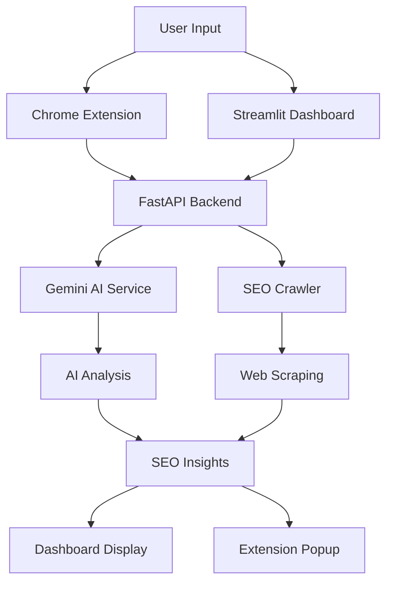
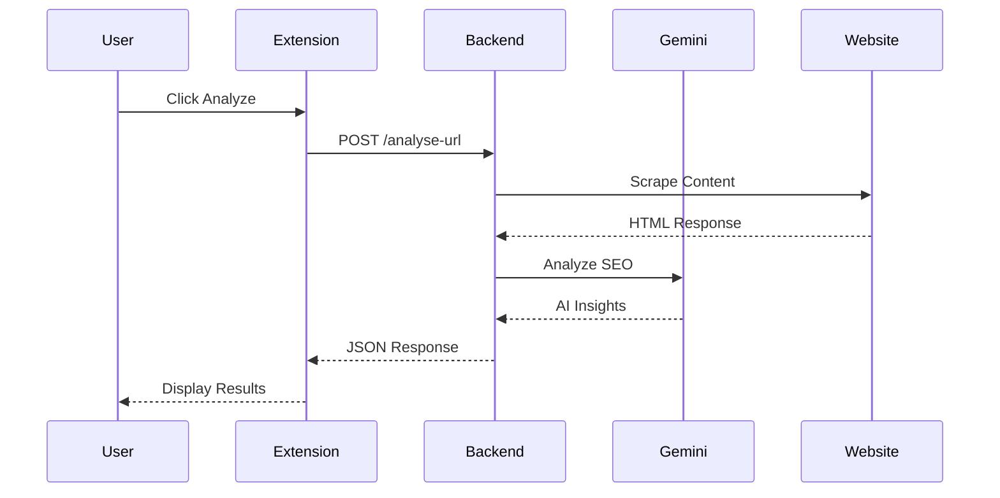

# 🚀 Metamorph SEO Dashboard

[](https://fastapi.tiangolo.com/)
[](https://streamlit.io/)
[](https://ai.google.dev/)
[](LICENSE)

**Metamorph SEO Dashboard** is an advanced AI-powered SEO intelligence platform that combines comprehensive website analysis, competitor research, and AI-driven content generation into a single, powerful toolkit.


---

## ✨ Key Features

### 🏆 Site vs. Site Comparison
- **Head-to-Head Analysis**: Compare two websites side-by-side on core SEO metrics
- **Visual Scorecards**: Interactive SEO score comparisons with detailed breakdowns
- **Strength & Weakness Analysis**: Identify competitive advantages and gaps
- **Real-time Metrics**: Live scoring across multiple SEO dimensions

### 🔍 Gap Analysis & Content Generation
- **AI-Powered Gap Detection**: Identify missing keywords and content opportunities
- **Smart Content Ideas**: Generate topic ideas based on competitive analysis
- **AI Article Writer**: Create SEO-optimized articles with proper HTML formatting
- **Tone Customization**: Professional, friendly, authoritative, and conversational writing styles

### 🎯 Competitor Intelligence
- **Automated Competitor Discovery**: Find top competitors in any niche
- **Industry-Specific Analysis**: Tailored competitor research based on your domain
- **Actionable Insights**: Get specific recommendations to outrank competitors
- **Authority Mapping**: Identify high-authority sites in your space

### 🔧 Chrome Extension
- **One-Click Analysis**: Instant SEO insights for any webpage
- **Real-time Scoring**: Get AI-powered SEO scores while browsing
- **Meta Tag Generation**: Auto-generate missing descriptions and keywords
- **Quick Boost Suggestions**: Immediate improvement recommendations

---

## 🛠 Technology Stack

| Component | Technologies |
|-----------|--------------|
| **Backend API** | FastAPI, Uvicorn, Pydantic |
| **AI Engine** | Google Gemini 2.5 Flash, Generative AI |
| **Dashboard** | Streamlit, Plotly, Custom CSS |
| **Frontend** | Chrome Extension (Vanilla JS) |
| **Data Processing** | BeautifulSoup4, Requests |
| **Deployment** | Gunicorn, Python-dotenv |

---

## 🚀 Quick Start

### Prerequisites
- Python 3.9+
- Google Gemini API Key
- Chrome Browser (for extension)

### Installation

1. **Clone the Repository**
```bash
git clone https://github.com/your-username/metamorph-seo-dashboard.git
cd metamorph-seo-dashboard
```

2. **Set Up Environment**
```bash
# Create virtual environment
python -m venv venv
source venv/bin/activate  # Linux/Mac
# or
venv\Scripts\activate    # Windows

# Install dependencies
pip install -r requirements.txt
```

3. **Configure Environment Variables**
```bash
# Create .env file
echo "GEMINI_API_KEY=your_gemini_api_key_here" > .env
```

4. **Start the Backend Server**
```bash
cd backend
uvicorn main:app --reload --port 8000
```

5. **Launch the Dashboard**
```bash
# New terminal window
cd backend
streamlit run dashboard.py
```

6. **Install Chrome Extension**
- Open Chrome and go to `chrome://extensions/`
- Enable "Developer mode"
- Click "Load unpacked" and select the `frontend/` directory
- The Metamorph SEO Assistant icon will appear in your toolbar

---

## 📁 Project Structure

```
metamorph-seo-dashboard/
├── backend/
│   ├── main.py                 # FastAPI server
│   ├── models.py               # Pydantic data models
│   ├── seo_crawler.py          # Web scraping utilities
│   ├── dashboard.py            # Streamlit dashboard (updated location)
│   ├── requirements.txt        # Python dependencies
│   └── utils/
│       └── gemini_helper.py    # Gemini AI service
├── frontend/
│   ├── popup.html              # Extension UI
│   ├── popup.css               # Extension styles
│   ├── popup.js                # Extension logic
│   └── manifest.json           # Extension config
└── README.md
```

---

## 🔄 Workflow

### Data Flow Architecture


### API Request Flow


### Real-time Analysis Process
1. **URL Submission** → User provides target URL
2. **Content Scraping** → Backend fetches and parses HTML
3. **AI Processing** → Gemini analyzes SEO elements
4. **Score Calculation** → Multiple factors weighted (0-100)
5. **Recommendation Generation** → Specific improvement suggestions
6. **Result Delivery** → Formatted response to client

---

## 🔌 API Endpoints

### `POST /analyse-url`
Analyzes a URL for comprehensive SEO metrics.

**Request:**
```json
{
  "url": "https://example.com"
}
```

**Response:**
```json
{
  "seo_score": 85,
  "ai_suggestions": ["Improve meta description", "Add header tags"],
  "strengths": ["Good page speed", "Mobile responsive"],
  "critical_issues": ["Missing alt tags", "No SSL"],
  "content_quality": "good",
  "page_title": "Example Page",
  "meta_description": "...",
  "keywords": ["example", "test"],
  "status_code": 200,
  "headers": {"h1": ["Main Title"], "h2": ["Subtitle"]}
}
```

### `POST /generate-article`
Generates SEO-optimized articles.

**Request:**
```json
{
  "topic": "Digital Marketing Trends",
  "keywords": ["SEO", "AI", "Marketing"],
  "tone": "professional"
}
```

### `POST /boost-seo`
Generates missing SEO tags and improvements.

---

## 🎯 Usage Examples

### Website Comparison
1. Open the Streamlit dashboard at `http://localhost:8501`
2. Enter two competitor URLs in "Site vs. Site Comparison"
3. View side-by-side SEO analysis with visual charts
4. Identify strengths and weaknesses with AI insights

### Content Gap Analysis
1. Enter your website URL in "Gap Analysis & Content Generation"
2. Get AI-generated gap analysis with specific recommendations
3. Generate content ideas based on missing keywords
4. Create optimized articles with selected tone and style

### Competitor Research
1. Enter your domain and industry in "Top Competitor Finder"
2. Discover top 5 competitors automatically
3. Analyze their SEO strategies and authority
4. Implement winning tactics from competitor analysis

### Quick Page Analysis
1. Browse to any webpage
2. Click the Chrome extension icon
3. Get instant SEO score and improvement suggestions
4. Generate missing meta tags with "Generate Boost" feature

---

## 🤖 AI-Powered Features

### Gemini AI Integration
- **SEO Scoring**: Intelligent 0-100 scoring based on multiple factors
- **Content Analysis**: Quality assessment and improvement suggestions
- **Keyword Optimization**: Smart keyword recommendations
- **Competitor Intelligence**: AI-driven competitor identification
- **Content Generation**: Human-like article writing with SEO best practices

### Smart Algorithms
- **Natural Language Processing**: Understands content context and quality
- **Pattern Recognition**: Identifies SEO best practices and violations
- **Predictive Analysis**: Suggests improvements based on successful patterns
- **Semantic Analysis**: Goes beyond keyword density to content relevance

---

## 👥 Development Team

| Team Member | Role | GitHub |
|-------------|------|--------|
| **Rakshak D** | Backend & AI Integration | [@Rakshak-D](https://github.com/Rakshak-D) |
| **Rohan S** | Frontend & Chrome Extension | [@rohanronniie](https://github.com/rohanronniie) |
| **Sadha Mail** | Data Processing & Analytics | [@Msadha27](https://github.com/Msadha27) |
| **Bhavana Gajanan Hegde** | UI/UX & Dashboard Design | [@Shinnosukedesu](https://github.com/Shinnosukedesu) |

---

## 🐛 Issue Reporting

Found a bug or have a feature request? [Open an issue](https://github.com/your-username/metamorph-seo-dashboard/issues) with:

1. **Description** of the problem
2. **Steps to reproduce**
3. **Expected vs actual behavior**
4. **Screenshots** (if applicable)
5. **Environment details**

---

## 📄 License

This project is licensed under the MIT License - see the [LICENSE](LICENSE) file for details.

---

## 🔮 Future Roadmap

- [ ] **Multi-language SEO Support**
- [ ] **E-commerce SEO Specialization**
- [ ] **Local SEO Features**
- [ ] **Backlink Analysis**
- [ ] **Rank Tracking Integration**
- [ ] **Social Media SEO**
- [ ] **Voice Search Optimization**
- [ ] **Mobile-First SEO Analysis**

---

## 📞 Support & Contact

For support, questions, or contributions:
- 📧 Email: bhavanahegde9@gmail.com
- 🐛 [Issue Tracker](https://github.com/your-username/metamorph-seo-dashboard/issues)
- 💬 [Discussions](https://github.com/your-username/metamorph-seo-dashboard/discussions)

---

## 🙏 Acknowledgments

- Google Gemini AI for powerful natural language processing
- FastAPI team for the excellent web framework
- Streamlit for rapid dashboard development
- BeautifulSoup for robust web scraping capabilities

---

**Transform your SEO strategy with AI-powered insights! 🚀**
