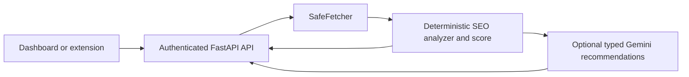

# SEO-Sensei

SEO-Sensei is an evidence-first SEO analysis platform. The API fetches pages
through a SafeFetcher, runs deterministic technical/content checks, and can add
optional Gemini recommendations. The deterministic score never depends on AI.

The Streamlit dashboard and Manifest V3 Chrome extension are authenticated API
clients; neither performs crawling or calls Gemini directly.

## Current scope

- URL analysis with deterministic, versioned 0–100 scoring
- bounded technical, metadata, headings, links, images, structured-data and
  social metadata checks
- optional typed AI recommendations and article generation
- authenticated FastAPI API with bounded in-memory rate limits
- API-only Streamlit dashboard and configurable-token Chrome extension

Competitor discovery, backlink analysis, rank tracking, traffic/authority
claims, and measured page-speed tooling are intentionally outside the current
scope. See [`docs/seo-scoring.md`](docs/seo-scoring.md) for score semantics.

## Technology

| Component | Technologies |
| --- | --- |
| API | FastAPI, Uvicorn, Pydantic v2 |
| Fetching | HTTPX/httpcore SafeFetcher with SSRF and size controls |
| AI | Google Generative AI SDK behind a typed service boundary |
| Dashboard | Streamlit API client |
| Extension | Vanilla JavaScript, Manifest V3 |
| Quality | Pytest, coverage, Ruff, Mypy, GitHub Actions |

## Developer setup

Supported Python versions are 3.11 and 3.12. The reproducible development install
includes runtime and pinned test/tooling dependencies:

```bash
python -m venv .venv
# Linux/macOS: source .venv/bin/activate
# Windows PowerShell: .venv\Scripts\Activate.ps1
python -m pip install --upgrade pip
python -m pip install -r requirements-dev.txt
copy .env.example .env  # PowerShell; use cp on Linux/macOS
```

Set `API_ACCESS_TOKEN` for protected API calls. `GEMINI_API_KEY` is optional for
deterministic analysis and tests. Never commit `.env` or real credentials.

Run the API and dashboard from the repository root:

```bash
python -m uvicorn backend.app.main:app --reload --port 8000
streamlit run backend/dashboard.py
```

The dashboard requires `API_BASE_URL` and
`DASHBOARD_API_ACCESS_TOKEN`. Load `frontend/` unpacked in Chrome, then set its
API origin and token through the extension options page. The token is stored as
local extension configuration and is never bundled in source control; this is
appropriate for a self-hosted/private deployment, not a multi-user identity
system. See [`docs/extension.md`](docs/extension.md).

## Quality checks

```bash
python -m pytest --cov --cov-report=term-missing
python -m compileall -q backend tests tools
python -m ruff check backend tests tools
python -m ruff format --check backend/app tests tools
python -m mypy backend/app
python tools/security_checks.py
node --check frontend/popup.js
node --check frontend/api-client.js
node --check frontend/options.js
python -c "import json; json.load(open('frontend/manifest.json', encoding='utf-8'))"
```

GitHub Actions runs these checks on pushes to `main` and pull requests to
`main` without live websites, Gemini credentials, or browser credentials.
Details are in [`docs/development.md`](docs/development.md).

## Container development

The API and dashboard can run as separate non-root containers. For local
Compose, copy `.env.example` to `.env`, set `API_ACCESS_TOKEN`, then run:

```bash
docker compose -f compose.yaml -f compose.dev.yaml build
docker compose -f compose.yaml -f compose.dev.yaml up -d
curl http://127.0.0.1:8000/health
```

The dashboard is available at `http://127.0.0.1:8501`; inside Compose it calls
the API at `http://api:8000`. The development overlay publishes the API and
dashboard on host loopback. Production Compose publishes only Caddy on ports 80
and 443. Detailed topology, health checks, secrets, and ingress assumptions are
documented in [`docs/deployment.md`](docs/deployment.md).

## Architecture


```mermaid
flowchart LR
    Client[Dashboard or extension] --> API[Authenticated FastAPI API]
    API --> Fetch[SafeFetcher]
    Fetch --> Engine[Deterministic SEO analyzer and score]
    Engine --> AI[Optional typed Gemini recommendations]
    Engine --> API
    AI --> API
```

Security and operational details:

- [`docs/security.md`](docs/security.md)
- [`docs/ai-integration.md`](docs/ai-integration.md)
- [`docs/dashboard.md`](docs/dashboard.md)
- [`docs/extension.md`](docs/extension.md)
- [`docs/development.md`](docs/development.md)

## License

This project is licensed under the MIT License; see [`LICENSE`](LICENSE).
