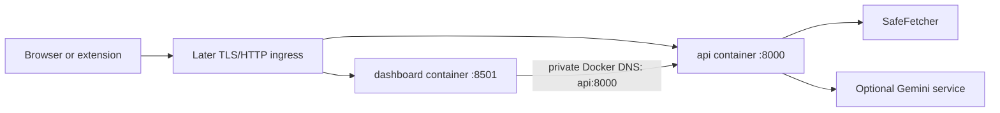

# Container deployment foundation

SEO-Sensei has two stateless containers:



The API and dashboard remain separate processes and images. The extension is a
browser-loaded artifact and is not part of either image.

## Images and startup

Both images use the pinned Python 3.11 slim Bookworm base, install only their
service-specific runtime requirements (`requirements-api.txt` or
`requirements-dashboard.txt`), run as the non-root `seo-sensei` user, and log to
stdout or stderr. The commands are:

```text
python -m uvicorn backend.app.main:app --host 0.0.0.0 --port ${PORT:-8000}
streamlit run backend/dashboard.py --server.address 0.0.0.0 --server.port ${PORT:-8501} --server.headless true
```

The images contain no `.env` file or credentials. Configuration is injected at
container start.

## Local Compose

Create a local environment file and set the fake/local credentials to real local
values:

```bash
copy .env.example .env  # PowerShell; use cp on Linux/macOS
# Set API_ACCESS_TOKEN, CONTAINER_APP_ENV=production, and optionally GEMINI_API_KEY in .env.
docker compose -f compose.yaml -f compose.dev.yaml build
docker compose -f compose.yaml -f compose.dev.yaml up -d
curl http://127.0.0.1:8000/health
```

Open the dashboard at `http://127.0.0.1:8501`. In the Compose network, the
dashboard reaches the API at `http://api:8000`; `127.0.0.1` inside the dashboard
container would refer to the dashboard container itself. The development
overlay publishes the API only on host loopback for local extension/API
testing.

The default `compose.yaml` publishes only the dashboard on host loopback and
keeps the API on the private Compose network. For a deployment behind an
ingress, remove or replace the dashboard port mapping as appropriate and route
the ingress to the two service ports. TLS, public DNS, and proxy configuration
are intentionally not implemented here.

## Configuration and secrets

Required for protected production API operation:

- `API_ACCESS_TOKEN`
- `ALLOWED_CORS_ORIGINS` appropriate to browser clients

`GEMINI_API_KEY` is optional. If it is empty, deterministic analysis remains
available and AI functionality reports a controlled unavailable/configuration
state. `DASHBOARD_API_ACCESS_TOKEN` must match the API token and remains only in
the dashboard container environment; it is never rendered to browser state.

The complete application/resource/rate-limit settings remain in `.env.example`.
Never commit `.env`, put secrets in a Dockerfile, or pass credentials in image
build arguments.

## Health and resources

The API health check calls the lightweight public `/health` endpoint only. It
does not authenticate, crawl, or call Gemini. The dashboard health check uses
Streamlit's local `/_stcore/health` endpoint. Compose waits for API health
before starting the dashboard and restarts unhealthy services according to the
container runtime policy.

The application is stateless: it has no database, SQLite file, generated file,
or required persistent volume. SafeFetcher response limits, connection pools,
Gemini concurrency, and process-local rate limits remain controlled by the
existing environment settings. The in-memory limiter is not global across
multiple replicas.

The containers use read-only root filesystems, a `/tmp` tmpfs, dropped Linux
capabilities, and `no-new-privileges`. These settings assume a normal container
runtime; no privileged mode, host networking, or Docker socket is required.

## What this phase does not provide

This is a containerization foundation, not a complete public deployment. It does
not provide TLS certificates, a reverse proxy, cloud infrastructure, a registry,
automatic deployment, persistent users, or distributed rate limiting. A later
ingress must expose the API origin used by the extension and dashboard clients.
