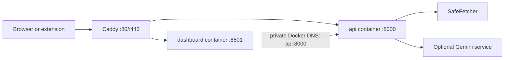

# Production ingress and container deployment

SEO-Sensei uses Caddy as the only public ingress and keeps the application
containers private:



The API and dashboard remain separate processes and images. The extension is a
browser-loaded artifact and is not part of either image. Caddy routes
`APP_DOMAIN` to the dashboard and `API_DOMAIN` to the API; separate hostnames
avoid path-prefix rewriting and simplify Streamlit websocket traffic and CORS.

## Images and startup

Both images use the pinned Python 3.11 slim Bookworm base, install only their
service-specific runtime requirements (`requirements-api.txt` or
`requirements-dashboard.txt`), run as the non-root `seo-sensei` user, and log to
stdout or stderr. The commands are:

```text
python -m uvicorn backend.app.main:app --host 0.0.0.0 --port ${PORT:-8000}
streamlit run backend/dashboard.py --server.address 0.0.0.0 --server.port ${PORT:-8501} --server.headless true
```

The images contain no `.env` file or credentials. Configuration is injected at
container start.

## Local Compose

Create a local environment file and set the local credentials and fake hostnames
to appropriate values:

```bash
copy .env.example .env  # PowerShell; use cp on Linux/macOS
# Set API_ACCESS_TOKEN, CONTAINER_APP_ENV=production, and optionally GEMINI_API_KEY in .env.
docker compose -f compose.yaml -f compose.dev.yaml build
docker compose -f compose.yaml -f compose.dev.yaml up -d
curl http://127.0.0.1:8000/health
```

Open the dashboard at `http://127.0.0.1:8501`. In the Compose network, the
dashboard reaches the API at `http://api:8000`; `127.0.0.1` inside the dashboard
container would refer to the dashboard container itself. The development
overlay publishes the API only on host loopback for local extension/API
testing.

The production `compose.yaml` publishes only Caddy on ports 80 and 443. API and
dashboard ports are exposed only to the Compose network. `compose.dev.yaml`
adds loopback-only API and dashboard ports and disables Caddy for convenient
local HTTP development. Do not use that overlay as a public deployment.

When `APP_DOMAIN` and `API_DOMAIN` resolve to the host, Caddy automatically
obtains certificates through ACME and redirects HTTP to HTTPS. The dashboard
is available at `https://app.example.com` and the extension should be pointed
at `https://api.example.com` (replace both examples with the configured values).

## Configuration and secrets

Required for protected production API operation:

- `API_ACCESS_TOKEN`
- `ALLOWED_CORS_ORIGINS` appropriate to browser clients
- `APP_DOMAIN`, `API_DOMAIN`, and `ACME_EMAIL` for Caddy-managed HTTPS
- `TRUSTED_PROXY_NETWORKS`, containing only the configured Caddy peer/network

`GEMINI_API_KEY` is optional. If it is empty, deterministic analysis remains
available and AI functionality reports a controlled unavailable/configuration
state. `DASHBOARD_API_ACCESS_TOKEN` must match the API token and remains only in
the dashboard container environment; it is never rendered to browser state.

The complete application/resource/rate-limit settings remain in `.env.example`.
Never commit `.env`, put secrets in a Dockerfile, or pass credentials in image
build arguments.

## Health and resources

The API liveness check calls the lightweight public `/health` endpoint. Compose
uses the separate `/ready` endpoint to confirm local SafeFetcher initialization.
Neither
endpoint authenticates, crawls, performs DNS resolution, or calls Gemini. The dashboard health check uses
Streamlit's local `/_stcore/health` endpoint. Compose waits for API health
before starting the dashboard and restarts unhealthy services according to the
container runtime policy.

The application is stateless: it has no database, SQLite file, generated file,
or required persistent volume. SafeFetcher response limits, connection pools,
Gemini concurrency, and process-local rate limits remain controlled by the
existing environment settings. The in-memory limiter is not global across
multiple replicas.

The containers use read-only root filesystems, a `/tmp` tmpfs, dropped Linux
capabilities, and `no-new-privileges`. These settings assume a normal container
runtime; no privileged mode, host networking, or Docker socket is required.

Caddy stores ACME certificates and its runtime configuration in the named
`caddy_data` and `caddy_config` volumes. These are the only persistent volumes;
back them up as deployment metadata, protect them like infrastructure state,
and do not place application secrets in them. The API and dashboard have no
persistent application state.

## Proxy trust, CORS, and limits

Caddy preserves the method, body, status, and websocket upgrade traffic while
reverse-proxying. FastAPI remains responsible for bearer authentication and
authorization. The API trusts forwarded client identity only from the static
Caddy address configured in `TRUSTED_PROXY_NETWORKS`; arbitrary client headers
are ignored. Caddy removes Authorization and Cookie fields from its access-log
format and the application never accepts query-string authentication.

Set `ALLOWED_CORS_ORIGINS` to the exact browser origins that need API access,
such as the deployed dashboard origin and the extension origin. Do not use `*`.
The proxy applies a 1 MB API request-body ceiling, matching the application's
1,000,000-byte body limit as defense in depth. SafeFetcher, Gemini, and API
timeouts remain application-controlled; Caddy does not impose a shorter
request timeout on normal API operations.

## What this phase does not provide

This phase provides a Caddy-based ingress configuration but is not a complete
cloud deployment. It does not provide DNS automation, cloud infrastructure, a
registry, automatic deployment, persistent users, or distributed rate limiting.
Real DNS records and ports 80/443 must reach the host before public ACME HTTPS
can succeed. TLS terminates at Caddy; internal API traffic remains HTTP on the
private Docker network.
